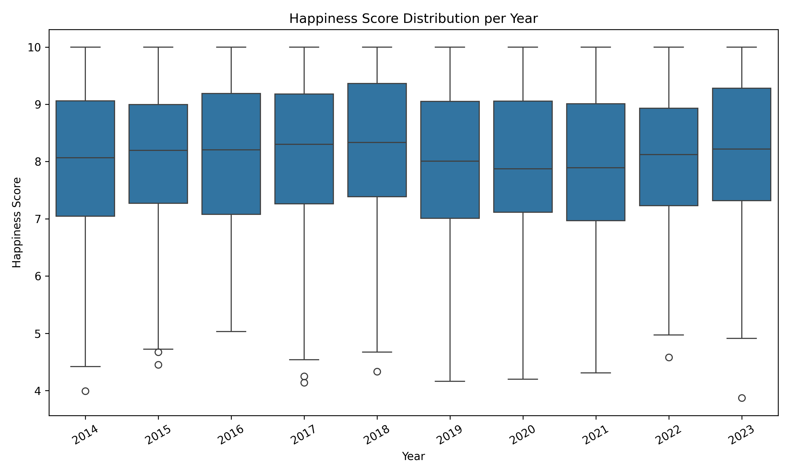
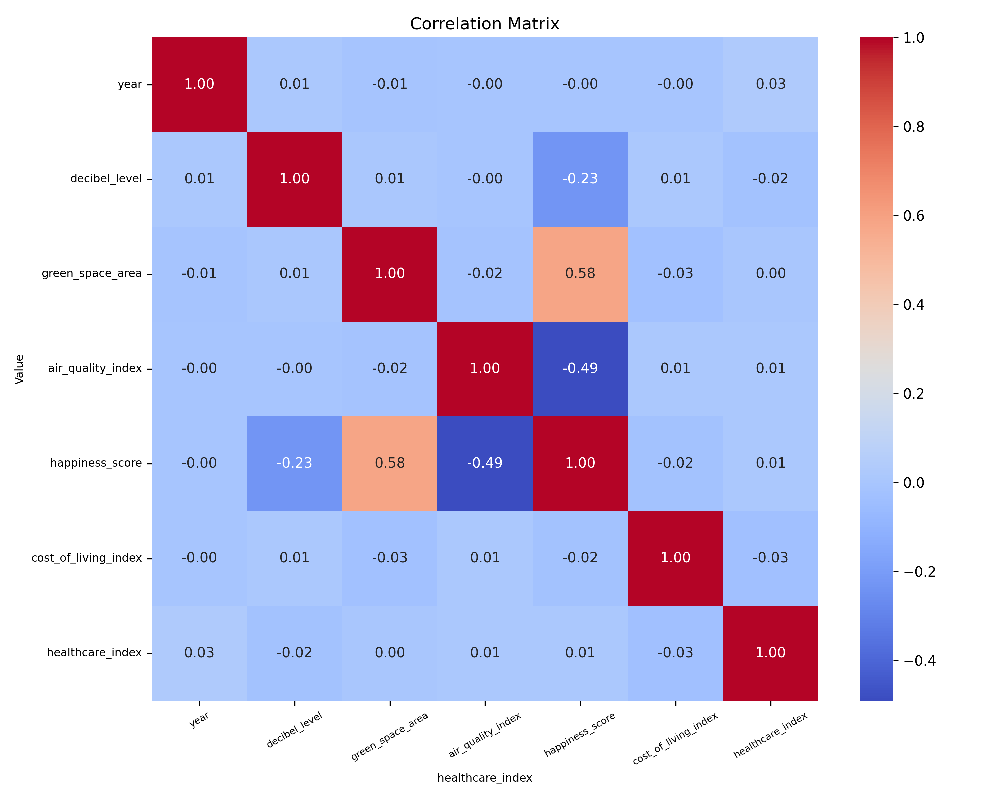
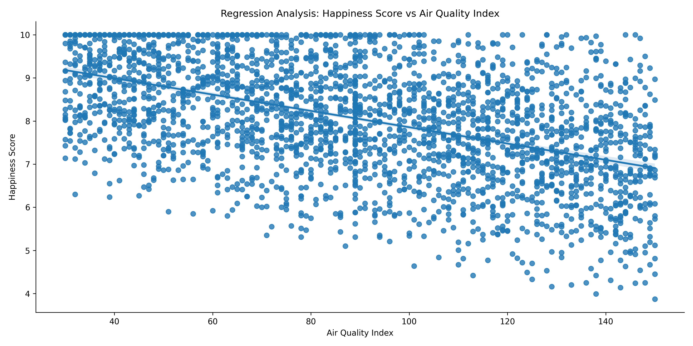

# Project City Happiness Index
A data analysis project exploring the happiness index across cities through data cleaning, transformation, EDA, and visualization; ending with an interactive dashboard to uncover key urban well-being insights
^
# Urban Happiness Data Analysis

## Project Overview
This project explores urban happiness metrics collected over a decade (2014-2024) across multiple cities and regions. The goal is to analyze factors that influence urban happiness and provide actionable insights for city planners and policymakers.

Using comprehensive data cleaning, exploratory data analysis (EDA), feature engineering, and regression modeling, the project uncovers key drivers such as green space, air quality, infrastructure, healthcare, and cost of living.

---

## What I Did
- **Data Cleaning & Preprocessing:**  
  Standardized column names, cleaned categorical data, handled missing values, and generated datetime features.

- **Exploratory Data Analysis (EDA):**  
  Visualized distributions, identified outliers, performed correlation and time series analysis.

- **Feature Engineering:**  
  Created composite scores like infrastructure and environment indices from raw variables.

- **KPI Analysis & Visualization:**  
  Calculated yearly happiness trends, percentiles, year-over-year changes, and identified the happiest years.

- **Regression Modeling:**  
  Analyzed the impact of multiple predictors on happiness scores using regression plots and residual analysis.

- **Business Question Insights:**  
  Generated targeted visualizations answering key questions about factors affecting urban happiness and regional performance.

- **Automation:**  
  Developed modular, reusable Python functions that automate the full analysis pipeline with organized output saving.

---

## Technologies & Libraries
- Python (pandas, numpy, matplotlib, seaborn, scikit-learn)
- Jupyter Notebook / Python scripts
- Data visualization & statistical analysis

---

## Key Insights
- Green space and air quality are positively correlated with urban happiness.
- Infrastructure quality (combining traffic density, noise, healthcare) strongly impacts happiness.
- Certain cities and years consistently outperform others in happiness scores.
- Cost of living and noise negatively affect happiness.
- Regional disparities exist, with environmental quality varying significantly by region.

---

## Visualization

**1. Happiness Score Over Time**

**2. Correlation Heatmap**

**3. Regression: Green Space vs Happiness**

---

## Business Questions Answered
- Which urban factors (e.g., green space, air quality, traffic, noise) have the strongest relationship with happiness?
- Are there cities with good infrastructure (e.g., low traffic, high healthcare) but still low happiness scores? Why?
- How has happiness evolved in each city over time? Are some cities improving faster than others?
- Do cities with high green space and good air quality have significantly higher happiness levels?
- Is there a tradeoff between cost of living and happiness? Do expensive cities always offer better well-being?
- Does high traffic density or decibel level negatively impact happiness?
- How strong is the relationship between healthcare quality and happiness?
- Which cities consistently rank at the top or bottom in happiness, and what distinguishes them?

---

## How to Run
1. Load the dataset (CSV format).  
2. Run the `main()` function in the provided Python script or notebook.  
3. Review generated plots saved in output directories (EDA, KPI, business questions).  
4. Explore modular functions to adapt the analysis to new datasets.

---

## Future Improvements
- Build an interactive dashboard for real-time data exploration.  
- Extend to forecasting happiness trends using time series models.  
- Incorporate more granular social and economic indicators.

---

## Contact
Name: Shweta Pandey 
Email: shwetapnd732@gmail.com 
LinkedIn: www.linkedin.com/in/shweta--pandey 
GitHub: shpandey07 

---

# Urban Happiness Data Analysis — Delivering actionable insights to improve city living through data.
